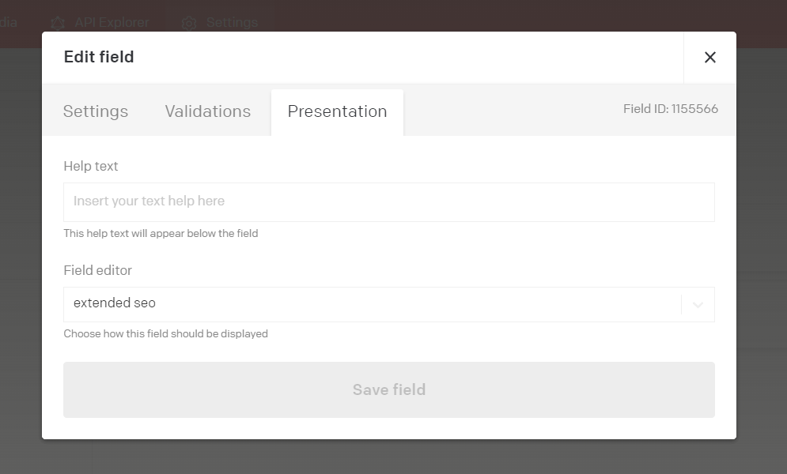

# [Your plugin name]

[Describe what your plugin does, and how users you can configure it! Screenshots are always welcome!]

# DatoCMS-plugin: Extended SEO


## About this repo :scroll:
This project was build using:
- React.js
- Javascript
- HTML/CSS

## Table of contents
- [About the plugin](#what-does-this-plugin-do)
- [Installation & development](#installation)
- [Adding plugin to DatoCMS for development](#adding-plugin-to-datocms--how-to-use-for-development)
- [About DatoCMS](#about-datocms-cloud)

## What does this plugin do?

### Description
This plugin extends the DatoCMS SEO meta field. This plugin allows users to see a preview of different sources generated from [Heads Up](https://github.com/voorhoede/heads-up).

### Functionalities
* Enables user to see extended SEO card previews
* Use data from the model you are working on
* Edit SEO fields and save it directly as SEO data.
* Using the Voorhoede Heads Up

#### Editor can edit fields
To edit the SEO-settings, the user can click on the configure button to open a modal with all the editable SEO-fields.

#### Upload an image
The user can also upload an image that will be shown in the cards.

#### Remove/reset settings
The user can click on the reset button to remove all data from the editable SEO-settings. The user can also remove an uploaded image by opening the SEO-settings modal and hover over the image uploader. A button will appear, and once pressed, the uploaded image will be removed.


## Installation on DatoCMS
First add this plugin via DatoCMS Settings > Plugins > Add ```(/admin/plugins/new)```.
Secondly add an API token to the global settings of the plugin.


## Installation for development

### Cloning
Make sure you have Node installed on your machine if you want to install this plugin for development. Start a new project in your code-editor and run the following command:


```bash
    git clone https://github.com/voorhoede/datocms-plugin-extended-seo

```

### Node Modules 📦
The following step is to install the node modules/packages. Install the packages by running the following command in your terminal:

```bash
npm install
```

### Starting the application :collision:
Now that all the node modules are installed, you can start the application by entering the following command in your terminal: 

```bash
npm start
```

## Adding plugin to DatoCMS for development
To add the plugin to your DatoCMS project, start by navigating to your DatoCMS project settings, go to plugins and add a new plugin.
Fill in the name of the plugin and the needed information. As entry point URL either fill in:

Please make sure to run your project locally so the project instantly changes while you save. If you are running your project locally fill in the following:

```bash
http://localhost:3000
```

If you already deployed the plugin, fill in your netlify (or your deployed site link) link in the entry point URL e.g:

```bash
https://datocms-plugin-titan-auction.netlify.app/
```

Make sure you enter the correct Field ID in the plugin model. You can do this by navigating to your models settings, edit the model settings and fill in your correct Field ID.
Also don't forget to fill in the name of your plugin in the field editor under the heading "Presentation": 



## About DatoCMS :cloud:
DatoCMS is a cloudbased headless CMS designed to work with static websites, mobile apps and server-side applications of any kind.

### What is a headless CMS?
A headless CMS clearly separates the actual content from the display layer and the front-end user experience.

The headless CMS concept is one born of the demands of the digital era and a business’s need to focus on engaging customers with personalized content via multiple channels at all stages of the customer journey.

As the content in a headless CMS is considered pure (because it has no presentation layer attached) just one instance of it can be used for display on any device; website, mobile, tablet, Internet of Things devices, smart watches, etc.

### API-first
DatoCMS provides a content infrastructure that comprises two different APIs for working with your content. Each of these APIs serve a different purpose, so which one to use depends on what you want to do:

- If you're retrieving content to display to users in an app or website, use the Content Delivery API.
- If you want to programmatically create or update content items, use the Content Management API.

### Multiple projects on one account
Once you signup to DatoCMS and create your account, you'll be able to create an arbitrary number of different projects. For each one of those you'll be given an administrative area at a specific domain (ie. https://[my-project].admin.datocms.com) from which you'll be able to invite a number of collaborators to manage its specific content. All the projects you create will be completely isolated from each other.

